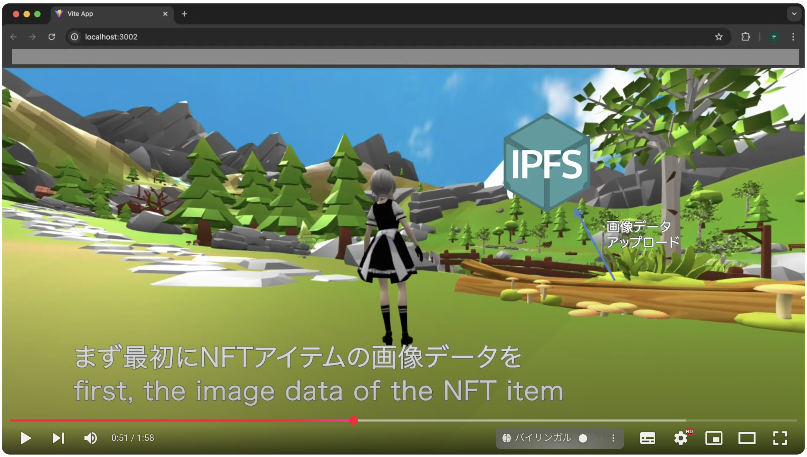
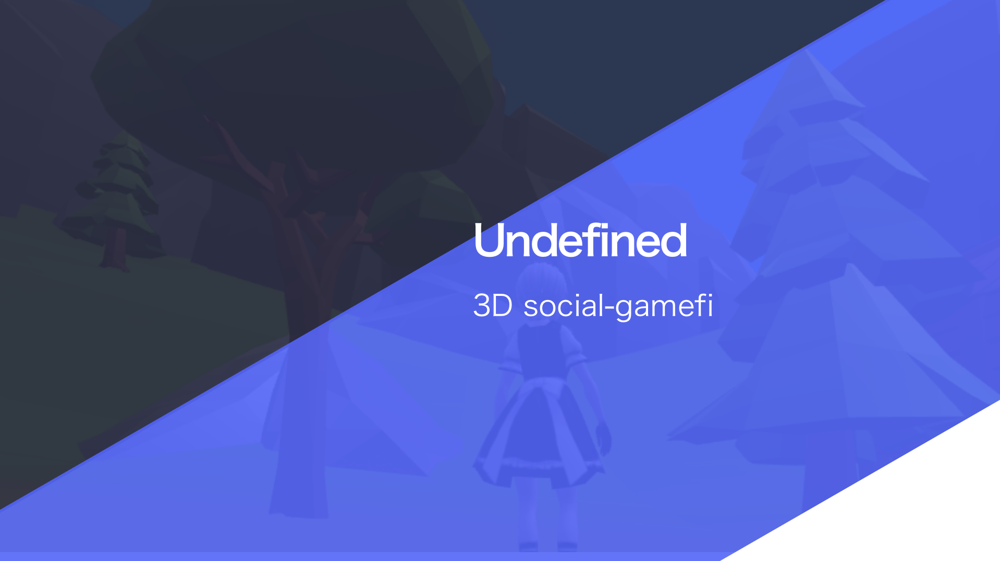
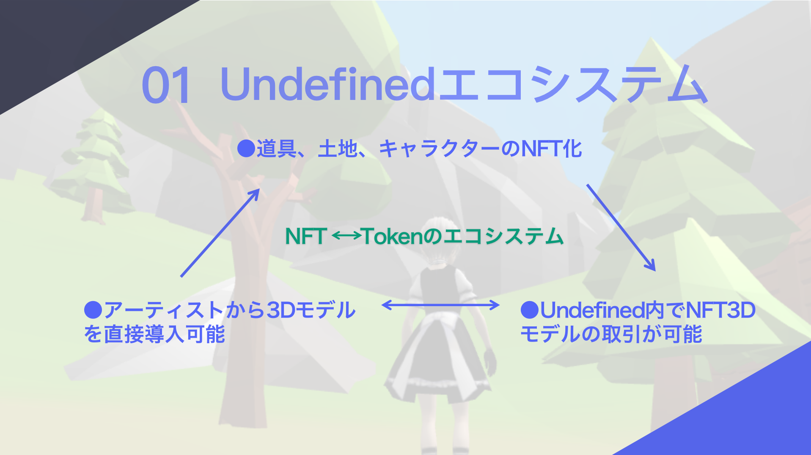
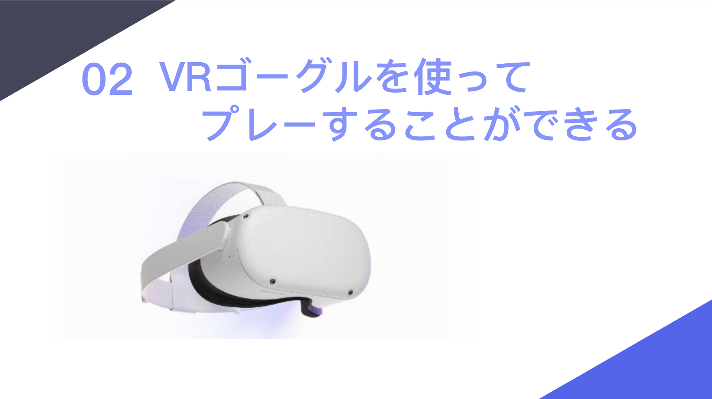
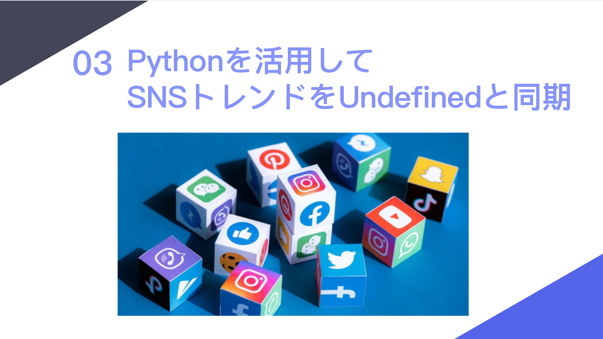

# 3Dgamefi demo for Polygon Tokyo Hacker House 2022
Polygon Tokyo Hacker House 2022 に参加するために作成された3D GameFiのデモです。3Dゲーム内で、SolidityのNFTコントラクトを使用してリアルタイムでNFTアイテムをミントする方法を示しています。This is a 3D GameFi demo created for participating in Polygon Tokyo Hacker House 2022, demonstrating how to mint NFT items in real-time within a 3D game using Solidity's NFT contracts.

# 下記の画像またはリンクをクリックすると、関連動画をご覧いただけます。
# Click the image or link below to watch the related video.
[3Dgamefi-Demo-Video](https://www.youtube.com/watch?v=ekYpRv584j4)

# 3D GameFiの全体コンセプトとエコシステムの概要
# Overview of the Overall Concept and Ecosystem of 3D GameFi

# 01 Undefinedエコシステム
・道具、土地、キャラクターのNFT化
・アーティストから3Dモデルを直接導入可能
・Undefined内でNFT 3Dモデルの取引が可能
・NFT ⇔ Tokenのエコシステム 

